# Ng Riddle

Hi there! My name is Nik and I have a problem.

I'm an owner of a small beer factory in US Utah. I've ordered a website from ***** inc for my factory. They've created everything but routing. I've been upset and sued them. I won the trial, they got my money back partially, however, I still need to complete my website.
That's why I'm asking you to help me and complete the routing configuration for my website.

I've prepared a work plan for you. It consists of 11 tasks for now.

> All the tasks has to be implemented with features from the **@angular/router** module.
> Please, don't try to do features via plain JavaScript hacks.

## How to start

Copy the following script to get started:

```shell
# Clone the repository
git clone git@github.com:Tibing/ng-riddle.git

# Go to the repository
cd ./ng-riddle

# Install node_modules
npm install

# Start an app
npm start
```

## Workflow

1. Checkout to the task's branch and pick up a task
2. Do what it asks you to do.
3. Send feature to the testing team using `npm test`.
4. If tests fail, go to point 2.
5. If all tests pass you can go to my solution, as **{task branch name}_done**.
6. Go to the next task.

## Table of contents
- [1. Setup routing](#1-setup-routing)
- [2. Configure menu links](#2-configure-menu-links)
- [3. Highlight active menu item](#3-highlight-active-menu-item)
- [4. Create posts list](#4-create-posts-list)
- [5. Fetch post's content](#5-fetch-posts-content)
- [6. Lazy-load dashboard](#6-lazy-load-dashboard)
- [7. Setup root redirect](#7-setup-root-redirect)
- [8. 404 page](#8-404-page)
- [9. Nested routes](#9-nested-routes)
- [10. Observe activated route](#10-observe-activated-route)
- [11. Relative links](#11-relative-links)

### 1. Setup routing

#### What you have to do

Go to the task branch

```shell
git checkout 1-setup-router-module
```

You have to add a routing module that will define which components to render for which page.

Here're pages:
- *ng-riddle* -> **NgRiddleComponent**
  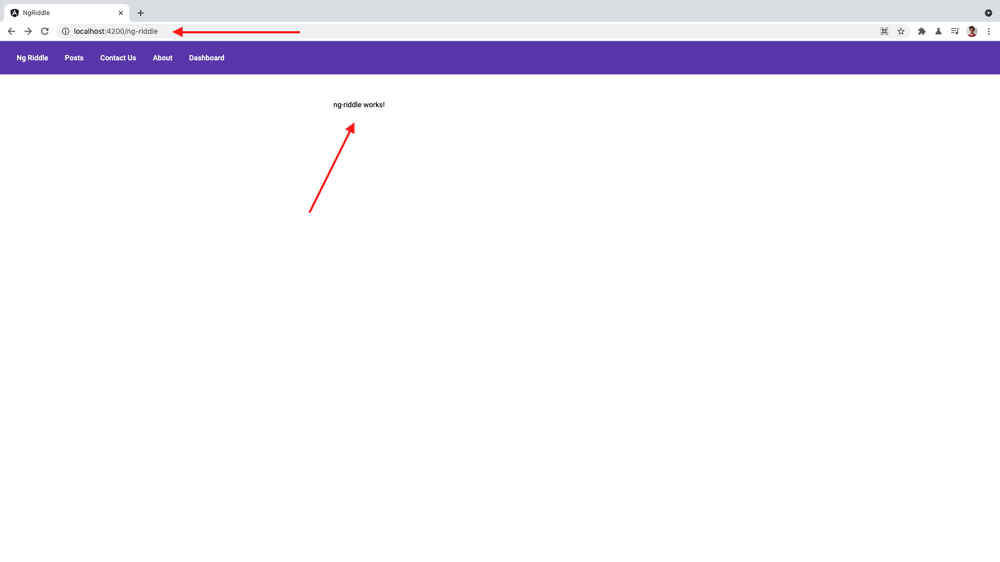
- *posts* -> **PostsComponent**
  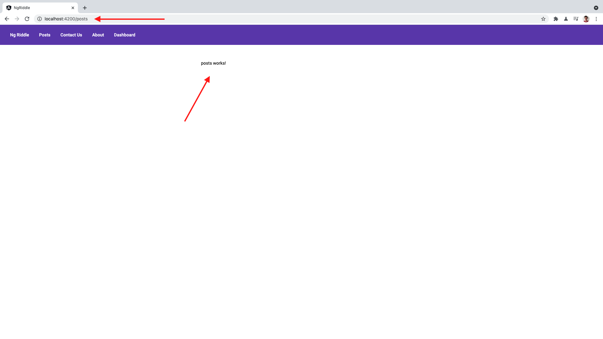
- *contact-us* -> **ContactUsComponent**
  
- *about* -> **AboutComponent**
  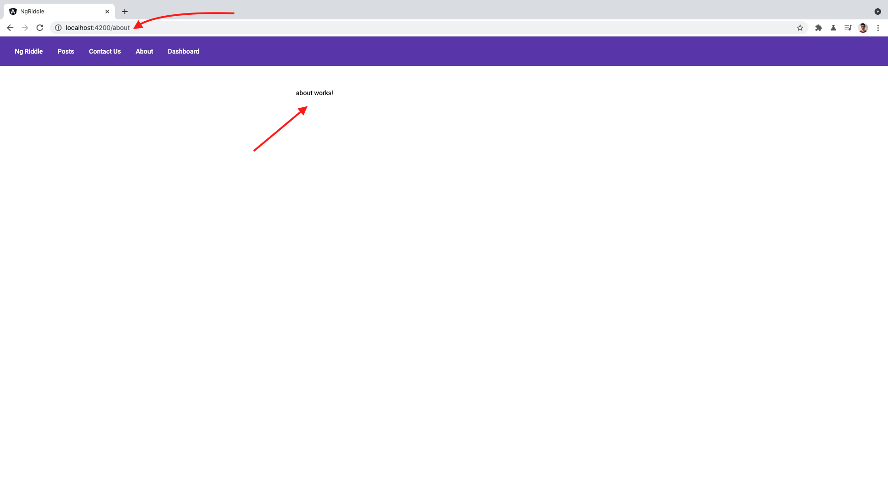
- *dashboard* -> **DashboardComponent**
  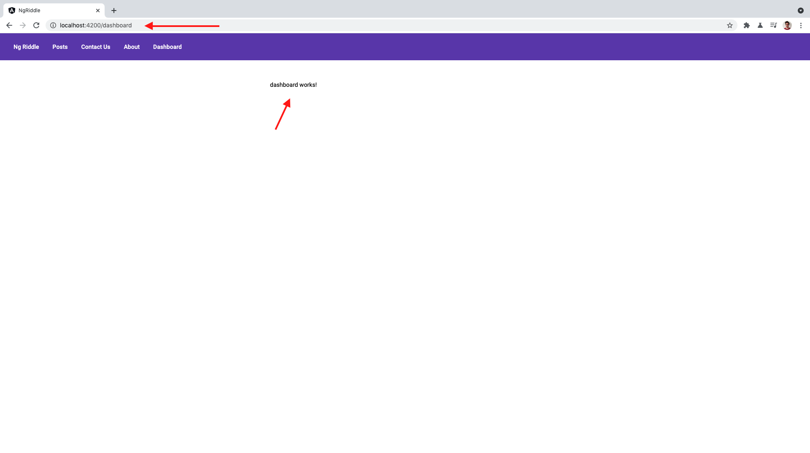

At this stage menu links shouldn't work.
We'll configure that at the next stage.
At this stage we're just configuring rendering of specific components for specific urls.

#### Useful links

- https://angular.io/guide/router#defining-a-basic-route

### 2. Configure menu links

#### What you have to do

Go to the task branch

```shell
git checkout 2-setup-navigation
```

At this stage you have to configure the menu and make sure that
appropriate links redirects the user to the appropriate component.

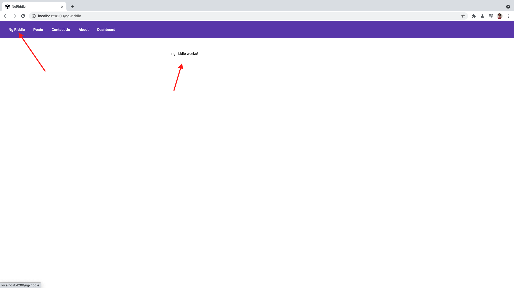

#### Useful links

- https://angular.io/guide/router#defining-a-basic-route

### 3. Highlight active menu item

#### What you have to do

Go to the task branch

```shell
git checkout 3-setup-active-route-styles
```

Make menu item highlighted when the URL corresponds for the specific menu item.
Notice on the screenshot below that *About* link is highlighted with white line.

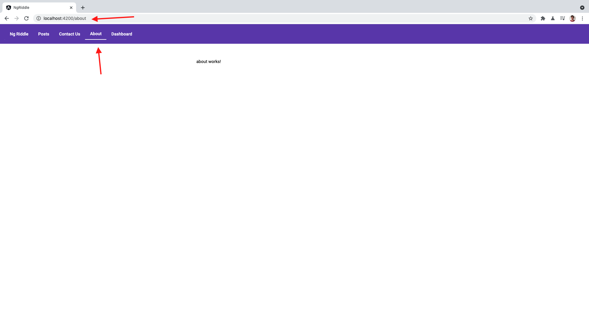

#### Useful links

- https://angular.io/guide/router#active-router-links

### 4. Create posts list

#### What you have to do

Go to the task branch

```shell
git checkout 4-params-and-activated-route
```

Previously, at the *posts* page you had nothing.
Only the **posts works!** text.
Now we have to create a list of posts there.
It ought to be a list of links.
Each link has to redirect the user to the specific post.

Here's how this list ought to look like finally (I've already done a small setup for you):

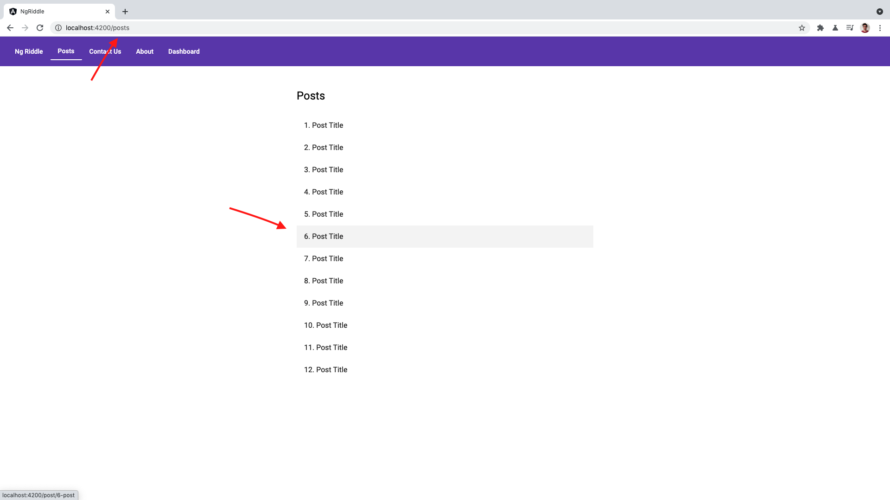

Here's how specific post page ought to look like finally (I've already done a small setup for you):

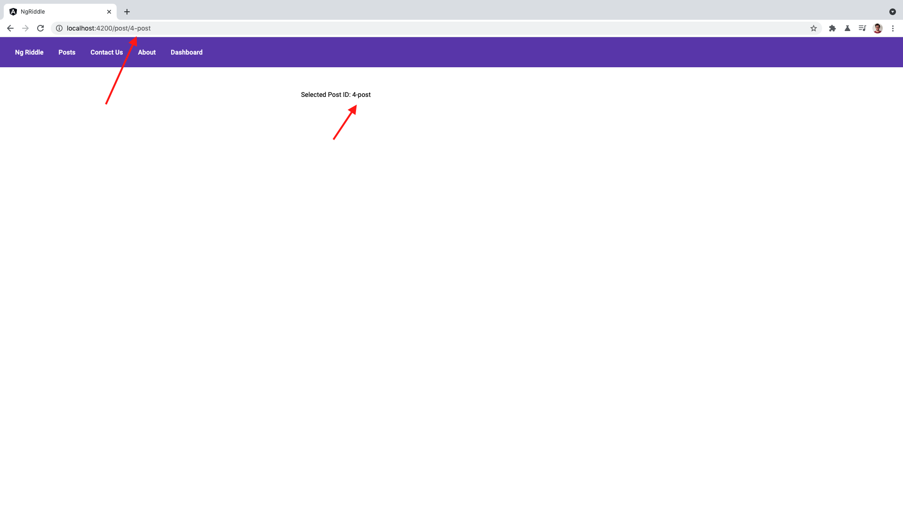

Post page has to render the following text - *Selected Post ID: {post id from url}*

#### Useful links

- https://angular.io/start/start-routing
- https://angular.io/guide/router#accessing-query-parameters-and-fragments

### 5. Fetch post's content

#### What you have to do

Go to the task branch

```shell
git checkout 5-post-content-resolver
```

At this stage you have to know how to create a basic routing and how to retrieve parameters from the url.
Now, you have to fetch content based on the url parameter.

Here's how post ought to look like finally:

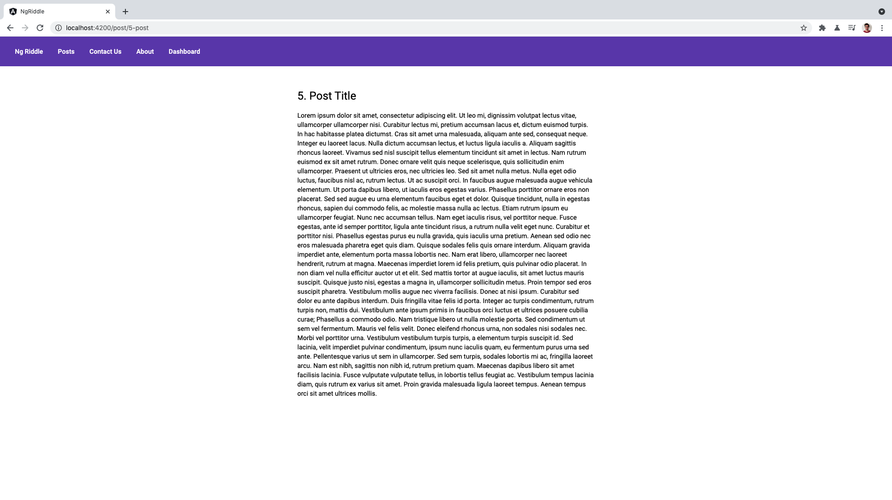

Fetch content before rendering the `PostComponent`.
The simplest way to do so is to use route resolver.
Use `PostService` as a server.

#### Useful links

- https://angular.io/api/router/Resolve

### 6. Lazy-load dashboard

#### What you have to do

Go to the task branch

```shell
git checkout 6-lazy-load-dashboard
```

Assume that the dashboard page is huge, not required for the initial loading and bloats the bundle.
To solve the problem you have to make it load lazily.

#### Useful links

- https://angular.io/guide/lazy-loading-ngmodules

### 7. Setup root redirect

#### What you have to do

Go to the task branch

```shell
git checkout 7-setup-root-redirect
```

Now, when you open an app at http://localhost:4200 it'll take you to the empty screen:

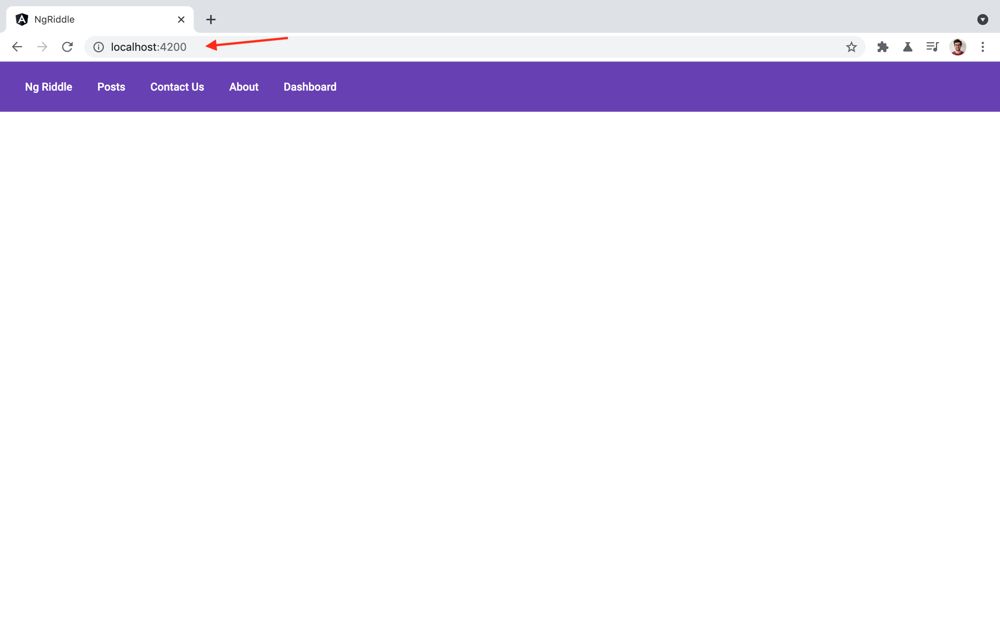

It doesn't look like an expected behavior. That's why you ought to reconfigure the router and force it to redirect empty path to **/ng-riddle** like at the picture below.

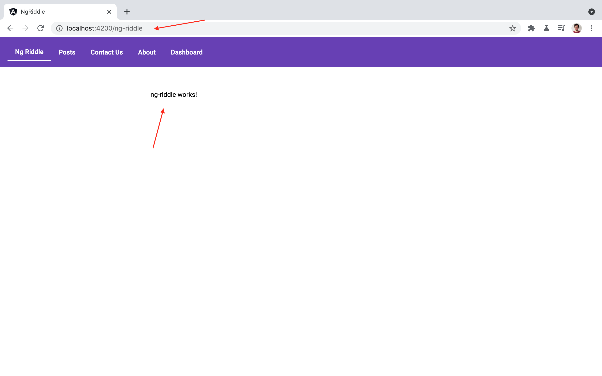

#### Useful links

- https://angular.io/guide/router#setting-up-redirects

### 8. 404 page

#### What you have to do

Go to the task branch

```shell
git checkout 8-404-page
```

If you go to the any random uri at the website you'll get an error at the console and an empty page :(

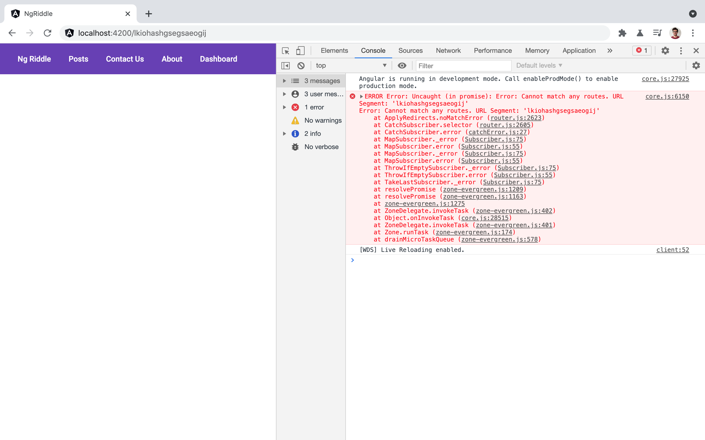

We definitely need to fix that! So, you have to reconfigure the router and force it to display a 404 page for any route we don't have. You ought to get the following result:

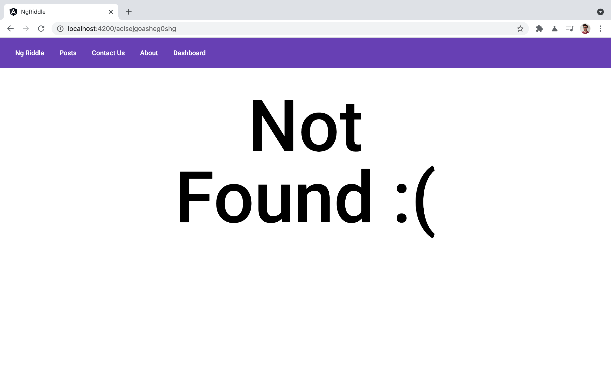

#### Useful links

- https://angular.io/guide/router#displaying-a-404-page

### 9. Nested routes

#### What you have to do

Go to the task branch

```shell
git checkout 9-nested-routes
```

At this stage, we're not doing any visual changes. Here you have to refactor the way how our posts routes structured. You need to make them nested.

So, you have to make the posts list load under **/posts**.
And each post has to be rendered under **/posts/1-post**, **/posts/2-post** and so on.

This and the following steps are preparation for the 11 task. We'll make links to the next and previous posts there.

#### Useful links

- https://angular.io/guide/router#nesting-routes

### 10. Observe activated route

#### What you have to do

Go to the task branch

```shell
git checkout 10-observe-activated-route
```

At this task you have to do one more refactoring. At the next stage, you'll have to implement links to the next and previous posts. These links will have to take the user from the **post** page to the **post** page. So, the page will stay the same, while the content will have to change.

It can be done easily with Angular router. However, you have to refactor the way you retrieve **data** from the activated route. For new, you're using an `activatedRoute.snapshot.data`. While Angular Router has an ability to subscribe to the **data** stream and render it on the screen.

Now you have to refactor the post component and make it subscribe to the data stream.

#### Useful links

- https://angular.io/guide/router#activated-route

### 11. Relative links

#### What you have to do

Go to the task branch

```shell
git checkout 11-relative-router-link
```

Here you have to implement next and previous links for each post:

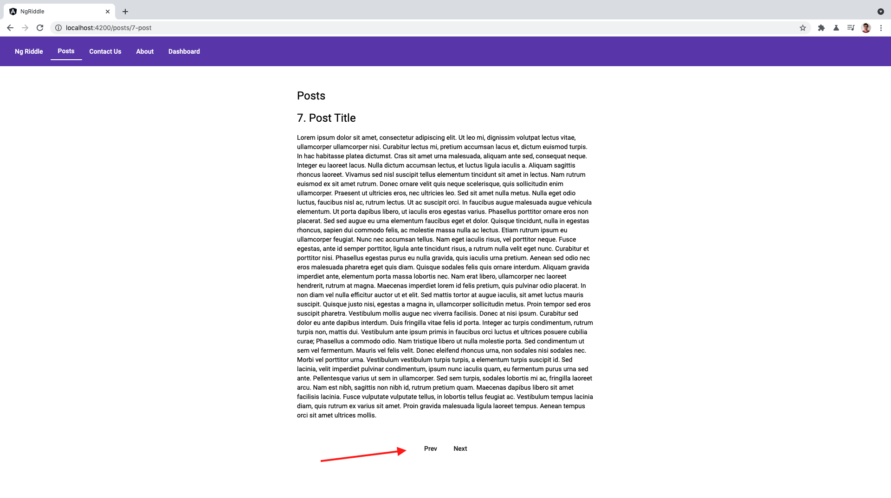

I've already crafted UI for you. You only have to implement navigation here.

#### Useful links

- https://angular.io/guide/router#using-relative-paths
